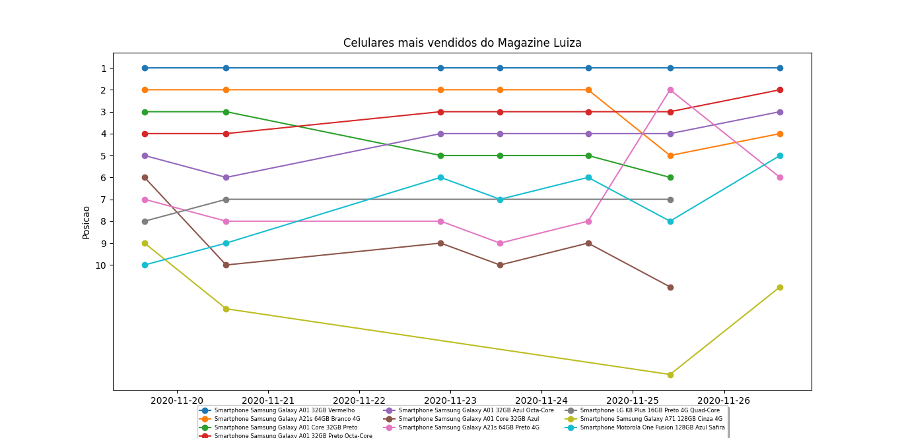

# ProjetoWebScrapping

Este projeto é um código que analisa dados dos 30 celualares que estão na página de mais vendidos da Magazine Luiza, a análise é feita diariamente e armazenada em um banco de dados.  

 
